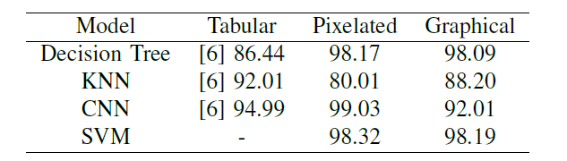
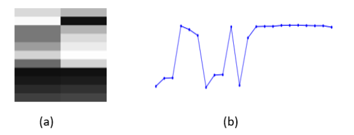

# Summary  
I was exploring a research paper that had findings of a material property prediction. In the article, they used CSV data of over two million samples and report an accuracy of around 83% with different models. My idea was to take the same data and convert it into images and apply different models which increase the accuracy significantly up to 90% with the only use of ten thousand samples.My motivation was to implement CNN because it does a good job on image classification.
# Application
This technique can be used in any large data set and implemented on CNN to increase the accuracy compared to statistical models.
# Advantages
Because CNN and other neural networks work well on images rather than CSV file base data, so it’s a good approach to go with, for better model accuracy.

# Convertion of tabluar data into images(a) and graphs(b) 
Tablular data single rwo would be look like this after transforming into images and graphs.

